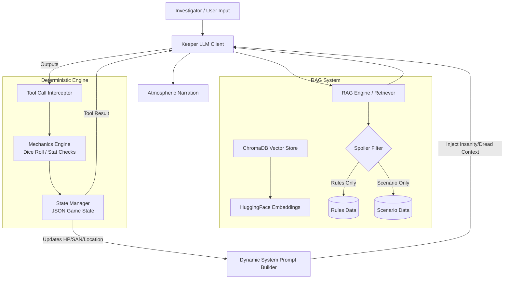

# CoC-KeeperBot: Autonomous LLM-RAG Game Master Engine

[](https://www.python.org/downloads/)
[](https://www.langchain.com/)
[](https://www.trychroma.com/)
[]()


> An end-to-end autonomous Tabletop Role-Playing Game (TTRPG) Game Master engine for *Call of Cthulhu 7th Edition*, combining Retrieval-Augmented Generation (RAG) with metadata filtering, deterministic state management via LLM tool calling, dynamic prompt injection, and a comprehensive AI evaluation benchmark.

---

## 📌 Summary

In Tabletop RPGs like *Call of Cthulhu*, a Game Master ("Keeper") must balance narrative storytelling with strict adherence to complex rulebooks, real-time tracking of character state (Hit Points, Sanity, Inventory), and secret scenario knowledge. Standard LLMs suffer from rule hallucinations, state drift, and "spoiler leakage" (revealing plot secrets prematurely).

**CoC-KeeperBot** solves these challenges through a hybrid architecture:
1. **Metadata-Filtered RAG ("Spoiler Filter")**: Distinguishes between public rulebook mechanics and confidential scenario secrets during retrieval.
2. **Deterministic Tool Calling & State Engine**: Offloads dice rolls, stat checks, and state mutations to a Python state machine via `<TOOL_CALL>` interception.
3. **Closed-Loop Dynamic Feedback**: Dynamically alters the LLM system prompt based on real-time game states (e.g., triggering perceptual uncertainty when temporary insanity occurs).
4. **Empirical AI Benchmarking**: Includes an A/B testing suite comparing RAG vs. non-RAG baselines, an automated rule retrieval quiz, LLM-as-a-Judge hallucination guardrails, and telemetry playtest log analytics.

---

## 🛠️ Key Tools, Methods & Tech Stack

This project highlights technical competencies across **Artificial Intelligence**, **Data Science / Information Retrieval**, and **Software Engineering**:

### 🧠 Generative AI & Orchestration
- **Structured Tool / Function Calling**: Intercepts custom `<TOOL_CALL>` tokens for deterministic execution of game actions, eliminating unconstrained LLM rule hallucinations.
- **Multi-LLM Provider Architecture**: Supported backends include **Google Gemini 1.5/2.0** (`langchain-google-genai`), **Qwen / DashScope API** via OpenAI compatibility, and **OpenAI GPT** models.
- **Dynamic System Prompt Injection**: Real-time state-aware prompt augmentation (e.g., modifying Keeper narrative tone upon Sanity loss).

### 🔍 RAG & Vector Database Engineering
- **LangChain Ecosystem**: `langchain-chroma`, `langchain-huggingface`, `langchain-text-splitters`, `langchain-community`.
- **Vector Store & Embeddings**: **ChromaDB** vector database with persistent storage; **HuggingFace Sentence Transformers** for dense semantic embeddings.
- **Advanced Retrieval Strategies**:
  - **Spoiler Filter (Metadata Partitioning)**: Tagging text chunks as `rules` vs. `scenario` to enforce targeted domain retrieval.
  - **Maximal Marginal Relevance (MMR)** & Score Thresholding: Diversifying retrieved rule snippets while discarding irrelevant context.

### ⚙️ Deterministic State Machine & Game Mechanics
- **Python Game Engine**: Custom modules (`mechanics.py`, `state_manager.py`) executing D100 dice mechanics, multi-tiered success checks (Regular, Hard, Extreme, Fumbles, Criticals), and state updates.
- **Persistent JSON State**: Real-time atomic tracking of HP, Sanity, MP, Skill Levels, inventory, and location coordinates.

### 📊 Data Science, AI Benchmarking & Evaluation
- **Quantitative Rule Quiz Benchmark (`rule_quiz.json`)**: 20 automated rule QA tests evaluating retrieval accuracy.
- **A/B Testing Framework (`compare_rag.py`)**: Comparative benchmark comparing RAG-enabled vs. Non-RAG baseline models across objective metrics (Rule Compliance Rate, Hallucination Frequency, Tool Call Validity).
- **LLM-as-a-Judge Guardrails (`evaluator.py`)**: Automated verification testing bot responses against invalid/hallucinated entity queries.
- **Telemetry & Log Analytics (`analyze_playtest_logs.py`)**: Metrics extraction parser measuring tool call frequency per turn, skill check ratio, and effect application rates across playtest logs.

---

## 🏗️ System Architecture



---

## 📁 Repository Structure

```
.
├── main_keeper.ipynb                  # Central Hub & Interactive Jupyter Demo
├── compare_rag.py                     # A/B Testing Script: RAG vs. Non-RAG Baseline Comparison
├── analyze_playtest_logs.py           # Telemetry & Playtest Log Analytics Script
├── demo_keeper_investigator_inter2.py # Interactive CLI Playtest Demo Script
├── test_keeper_investigator_inter.py  # End-to-end Integration Test Suite
├── requirements.txt                   # Project Dependencies
├── .env                               # Environment Configuration (API Keys)
│
├── src/                               # Core Source Code Modules
│   ├── __init__.py
│   ├── llm_client.py                  # LLM API Calls, Provider Management & System Prompts
│   ├── rag_engine.py                  # Document Vectorization, Chunking & RAG Retrieval
│   ├── state_manager.py               # Deterministic JSON Game State Persistence
│   ├── mechanics.py                   # D100 Dice Rolling & Call of Cthulhu 7th Ed Rules Logic
│   ├── tools.py                       # LLM Tool Registry, Interception & Execution
│   └── evaluator.py                   # LLM Evaluation Suite & Benchmarking Functions
│
├── data/                              # Data Storage & Vector Store
│   ├── raw/                           # Input PDF Rulebooks & Scenarios
│   ├── processed/                     # Processed Text Chunks (rules.txt, scenario.txt)
│   ├── chroma_db/                     # Persistent ChromaDB Vector Index
│   ├── rule_quiz.json                 # Quantitative Evaluation Rule Quiz Dataset (20 questions)
│   └── game_state.json                # Live Game State Storage
│
├── tests/                             # Unit Test Suite
│   ├── test_mechanics.py              # Unit Tests for Game Mechanics & Dice Logic
│   └── test_llm_api.py                # LLM Provider API Connectivity Tests
│
├── log/                               # Playtest Telemetry & Execution Logs
├── evaluation/                        # Evaluation Output Reports & Metrics
└── config/                            # Server & Jupyter Proxy Configurations
```

---

## 🧪 Evaluation & Empirical Results

The project features a full empirical evaluation pipeline to validate system performance:

1. **A/B Comparison (RAG vs. Non-RAG)**:
   - Evaluated across 15 structured game scenarios using `compare_rag.py`.
   - **Key Finding**: RAG-enabled execution demonstrated a significant reduction in rule hallucinations and higher accuracy in tool-call parameter formatting compared to zero-shot non-RAG baselines.

2. **Quantitative Rule Retrieval Benchmark**:
   - 20-question automated evaluation dataset (`data/rule_quiz.json`) targeting Call of Cthulhu 7th Edition Quick-Start rules.

3. **Hallucination & Entity Guardrails**:
   - Evaluates LLM responses against out-of-scope/non-existent entities (e.g. querying for Cthulhu in a local house scenario) using LLM-as-a-Judge validation.

4. **Telemetry & Log Analysis**:
   - `analyze_playtest_logs.py` parses execution logs to calculate tool calls per turn, percentage of no-check narrative turns, and effect distribution (HP loss, Sanity loss, item acquisition, movement).

---

## 🚀 Getting Started

### Prerequisites

- Python 3.9 or higher
- An API Key for one of the supported LLM providers (**Google Gemini**, **Qwen/DashScope**, or **OpenAI**)

### Installation

1. **Clone the repository:**
   ```bash
   git clone https://github.com/your-username/CoCKeeperBot.git
   cd CoCKeeperBot/project
   ```

2. **Install dependencies:**
   ```bash
   pip install -r requirements.txt
   ```

3. **Configure Environment:**
   Create a `.env` file in the `project/` directory:
   ```env
   LLM_PROVIDER=gemini
   GEMINI_API_KEY=your_gemini_api_key_here
   
   # Optional: Qwen / DashScope Configuration
   # DASHSCOPE_API_KEY=your_dashscope_key
   # OPENAI_BASE_URL=https://dashscope-intl.aliyuncs.com/compatible-mode/v1
   ```

4. **Build Vector Database:**
   ```bash
   python -c "from src.rag_engine import build_vector_database; build_vector_database(reset=False)"
   ```

---

## 💻 Usage & Running Experiments

### 1. Interactive Jupyter Notebook
Launch the main demonstration notebook:
```bash
jupyter notebook main_keeper.ipynb
```

### 2. Interactive CLI Playtest
Run a simulated game session:
```bash
python demo_keeper_investigator_inter2.py
```

### 3. Run A/B RAG Comparison Report
Generate an empirical comparison between RAG and non-RAG models:
```bash
python compare_rag.py
```
*Report output will be saved to `./evaluation/rag_comparison_report.txt`.*

### 4. Run Telemetry & Playtest Log Analytics
Analyze game session logs for quantitative metric breakdowns:
```bash
python analyze_playtest_logs.py log/test_keeper_investigator_inter.log
```

### 5. Run Full Evaluation Suite
Run all benchmarks (Rule Quiz, Sanity Mechanics, Hallucination Checks):
```bash
python -c "from src.evaluator import run_all_evaluations; run_all_evaluations()"
```

### 6. Run Unit Tests
```bash
python -m unittest discover tests/
```

